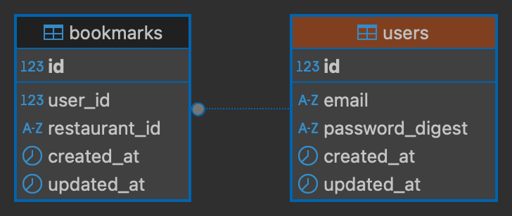

# RadarEat
「日常に小さな発見を」  
現在地周辺の飲食店を素早く検索・ブックマークできるWebアプリケーションです。

## コンセプト
現在地周辺の飲食店を素早く見つけられる操作性を重視しました。  
検索条件を「現在地からの距離」に絞ることで、日常の行動圏外にある魅力的なお店との偶然の出会いが生まれると考えています。

## 開発環境
- VS Code 1.98.2
- Docker Desktop 4.25.2
- Docker Engine v24.0.6
- Docker Compose v2.23.0-desktop.1

## 使用技術
### バックエンド
- Ruby 3.2.2
- Ruby on Rails 8.0.2（APIモード）
### ロントエンド
- TypeScript 5.8.3
- Next.js 15.2.4
- React 19.0.0
- Tailwind CSS 4.1.3

### 使用API・ライブラリ
- ホットペッパーグルメサーチAPI
- Geolocation API
- react-icons

## データベース構成（ER図）
RadarEatでは、ユーザーとブックマークの関係を以下のように管理しています。
